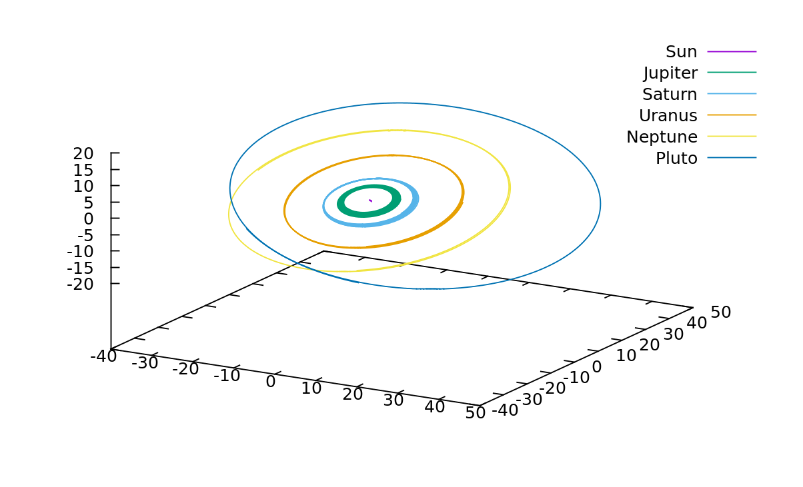
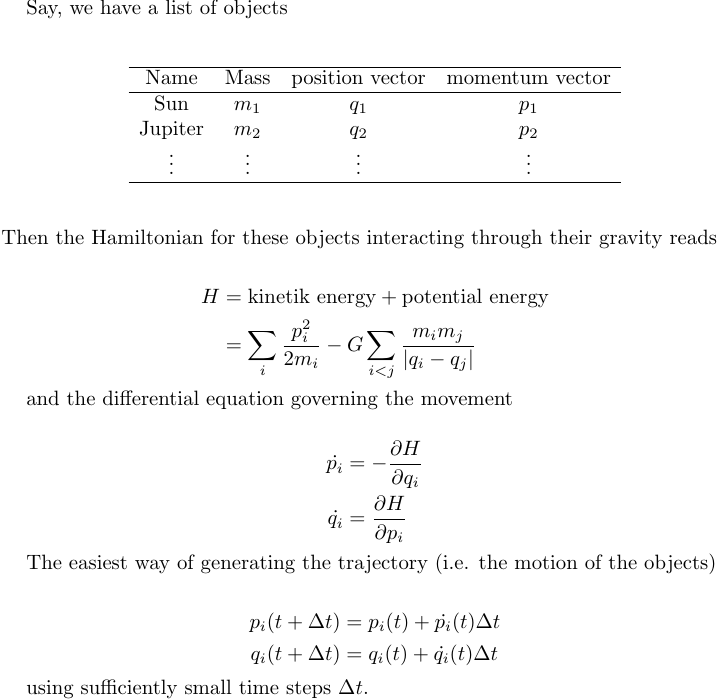

# Solar System

 

## Equations of motion

This simulation uses [Hamiltonian mechanics](https://en.wikipedia.org/wiki/Hamiltonian_mechanics) to calculate the dynamics of the solar system:

     

## Building and running
To just build & run to check if it works, execute 

```console
dac/Examples/SolarSystem$ ./makeRun.sh
```

## Plotting and playing
Reminder from [DAC-Readme](../../README.md): The [Generator](Generator)-binary generates the computational graph and from that the C-code which will perform the actual simulation. The [Executor](Executor)-binary runs this code and registers a callback function, which receives the state of the simulation at each time step.

Consequently, if you want to change any simulation parameters (time-increment step size, number of iterations, ...), you have to compile & run the Generator and then compile & run the Executor again.
    
Use
 
```console
dac/Examples/SolarSystem$ Executor/build/main.out -h
```
for an overview of provided options. Run the simulation with 

```console
dac/Examples/SolarSystem$ Executor/build/main.out -p ./State.csv -i 1000
```

After running the simulation, open Gnuplot and

```console
dac/Examples/SolarSystem$ gnuplot 
gnuplot> load "gnuplot.p"
```

To change the number of simulation steps or the stepsize, use

```console
dac/Examples/SolarSystem$ Generator/build/main.out -h
```

for an overview of provided options and run it afterwards to generate the code with new stepsize/runtime.

## Optimization
You may use gcc's feedback directed optimization feature to optimize the code: 
* Choose some reasonably large number of iterations that doesn't take too long (e.g. 1000)
* compile and run the simulation with special gcc options (see below)
* GCC will create a run profile helping it to unroll loops and decide which branches are more or less likely
* Change the number of iterations to the large value you are actually interested in
* Recompile with gcc using the profile information
* It yields another ~5% speed increase.

```console
dac/Examples/SolarSystem/Executor$ make clean
dac/Examples/SolarSystem/Executor$ make BCONFIG=PROFILE_GENERATE
dac/Examples/SolarSystem/Executor$ /build/main.out
dac/Examples/SolarSystem/Executor$ make clean
dac/Examples/SolarSystem/Executor$ make BCONFIG=PROFILE_USE # This will create the faster binary, so change iteration number before this step
```

## Linux scheduler
If the binary is executed privilidged or the binary itself is granted sufficient rights

```console
dac/Examples/SolarSystem/Executor$ sudo setcap 'cap_sys_nice=eip' build/main.out
```

all threads will be run at highest priority using SCHED_FIFO.
