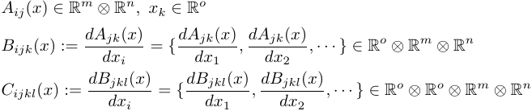

# DAC (Distributed Algebraic Computations)
DAC provides a C++ library to express and perform algebraic computations on [computational graphs](#computationalgraphs). The computational graphs are created through a C++ interface, which then generates C-code to perform the actual computations.

As yet it is restricted to Linux use only. This limitation, however, is only due to the use of [pthreads](https://en.wikipedia.org/wiki/POSIX_Threads) and will be improved upon in the future.

The library is currently in an early proof of concept state, with many interface changes ahead. It contains a plethora of open ends, where it's not yet clear how to design a scalable architecture for certain problems. The current strategy is to experiment by implementing some [use-cases](#projects) to get a feeling for this.

* [TL;DR](#tldr)
* [Target use case](#usecase)
* [Features](#features)
* [Workflow](#workflow)
* [Computational graphs?](#computationalgraphs)
* [Design decisions](#design)
* [ToDo](#todo)

<a name="tldr"></a>
## TL;DR
* The top level [makeRun.sh](./makeRun.sh) compiles & executes all unit tests & examples and checks that they work as intended.
 
```console
dac$ ./makeRun.sh
Running unit tests...Passed!

Running examples:
Running solar system...Passed!

Everything passed!
```
* Check out the [solar system](Examples/SolarSystem) example. Start by following the suggestions in the [README](Examples/SolarSystem/README.md).

<a name="usecase"></a>
## Target use case
DAC focuses on numerical problems requiring many algebraic operations, where the overhead of a function call for such an operation may be neglected. Specifically, problems where the same operations on large arrays are run many times, as is the case in typical optimization / simulation problems (e.g. machine learning, any physical simulation, ...).

If only a few dozen vector/matrix operations in a couple of dimensions is required, one will be better off using [Eigen](http://eigen.tuxfamily.org/index.php?title=Main_Page) or some [BLAS](http://www.netlib.org/blas/)-like library.

<a name="features"></a>
## Features
### Standard
- [Automatic differentiation](https://en.wikipedia.org/wiki/Automatic_differentiation)
- Global optimization over whole [computational graph](#computationalgraphs)

### Unique
- Everything is a n-Tensor, greatly simplifying derivative handling. In particular, it enables taking more than the first derivative in a consistent fashion, e.g. derivative of a 2-Tensor = Matrix is a 3-Tensor and so forth (notice, that DAC uses the convention that derivative indices are added in the front):   
- Easy access to special objects (e.g. [Kronecker delta](https://en.wikipedia.org/wiki/Kronecker_delta), ...) with efficient implementations for operations using them.
- Interface is closer to standard mathematical literature, e.g. one defines a [vector space](https://en.wikipedia.org/wiki/Vector_space) and may then declare something an element of that space
- This enables [group representations](https://en.wikipedia.org/wiki/Group_representation) on that space which in turn optimize numerics: E.g. the product of [rotation matrices](https://en.wikipedia.org/wiki/Rotation_matrix) is a rotation matrix, rotation matrices are orthogonal, ...
- The generatated code which performs the actual computations is C-code with no external libraries and may thus be run on any hardware

<a name="workflow"></a>
## Workflow
### Generation
* Create a program for the computational graph & code generation using this library. In the examples and unit tests of this project, this is done inside the "Generator" folders.
* Have that program generate code into some library folder for the...

### Execution
* Create a program which compiles & executes the code generated in the last step. In the examples and unit tests of this project, this is done inside the "Executor" folders.
* Inside that program, set callback functions to interface to the graph, to e.g. get the output of a node whenever it was executed

<a name="computationalgraphs"></a>
## Computational graphs
A computational graph is a graph where each nodes either holds a variable or an operation on variables, e.g. to express 

")
		         
Why go through this trouble? It enables generating symbolic derivatives by using the chain rule on the graph ("[Backpropagation](https://en.wikipedia.org/wiki/Backpropagation)") and global optimization, e.g. 

da")             

Notice, that the derivative output does not recalculate the sum and square root, but uses the node already existing - that would be an example of global optimization.

Furthermore, graphs make for easy parallelization, that is destribution of work among multiple processors. 

<a name="design"></a>
## Design Decisions
### Why generate code?
- The compiler has an easier time optimizing the code, because many things which would be variables are constants and [branching](https://en.wikipedia.org/wiki/Branch_(computer_science)) can be reduced to the absolute minimum
- Enabes using e.g. [feedback directed optimization](https://en.wikipedia.org/wiki/Profile-guided_optimization) (see [solar system](Examples/SolarSystem) example)
- Generating custom code offers (theoretically) the fastest possible solution
- Makes the code less complicated
- Enables customization, e.g. loop-unrolling according to how many floating point units, ...

### Why C? 
- Close to hardware
- Supported on all architectures. In particular embedded.

<a name="todo"></a>
## TODO

<a name="projects"></a>
### Projects
- [ ]	[Convolutional neural network](https://en.wikipedia.org/wiki/Convolutional_neural_network) operations (ongoing)
- [ ]	[Partial differential equations](https://en.wikipedia.org/wiki/Partial_differential_equation): Current ultimate goal of this project is to provide a framework where ([physical](https://en.wikipedia.org/wiki/Field_(physics))) PDEs may be solved geometrically, based on their formulation in the language of [differential forms](https://en.wikipedia.org/wiki/Differential_form). This will require some form of [triangulation](https://en.wikipedia.org/wiki/Triangulation_(geometry)) and operations thereon. It's going to take a while.

### Improvements
- [ ]	Create Doxygen documentation of user interface
- [ ]	Introduce some coding convention
- [ ]	The files copied from [The Linux Programming Interface](http://man7.org/tlpi/) should either be replaced or used more consistently
- [ ]	Include gcov with unitTests and generate coverage.
- [ ]	Restructure code: Interface user -> graph -> code generator should be well-defined.
- [ ]   Create some clean interface to jobPool
- [ ]	NodeRef::StoreIn offers no protection from overwriting data not yet consumed by other nodes
- [ ]	Better solution for control transfer: Current solution only works if there is a single root to the while part.
- [ ]	For debugging, NodeRefs should implement PrintInfo()
- [ ]	Get rid again of homomorphism?
- [ ]	Every contraction/product with kronecker makes vector sparse
- [ ]	Make vector properties a map<property, const void *>
- [ ]	Error cnt in code generator accessible to user.
- [ ]   Put initializer values into separate header? they can become very long.
- [ ]   __space_ should be private. And offer a function which returns a const pointer/ref to it.
- [ ]	It's weird that VectorSpace::Vector rather than VectorSpace::Element.
- [ ]	Rename Vector -> Tensor? Imagine someone using namespace std and then Cpp-Vectors.
- [ ]	Rethink that vector space pointer business.
- [ ]	Introduce "scaling" to vectors, so that e.g. for scalar multiplication not the whole vector needs to be multiplied
- [ ]   Introduce optimized memory handling: Not every node needs to be statically allocated. Memory may actually be globally optimized on graph
- [ ]   How to deal with special vectors? E.g. starting with Kronecker? They all require special operator-implementation. The current solution isn't scalable.
- [ ]   To enable DAC on non-unix single-core targets, it should be possible to build without pthreads.
- [ ]	Check that all printf of floats uses all floating digits in code generator!